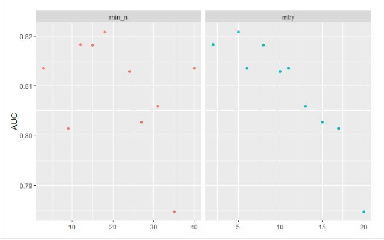
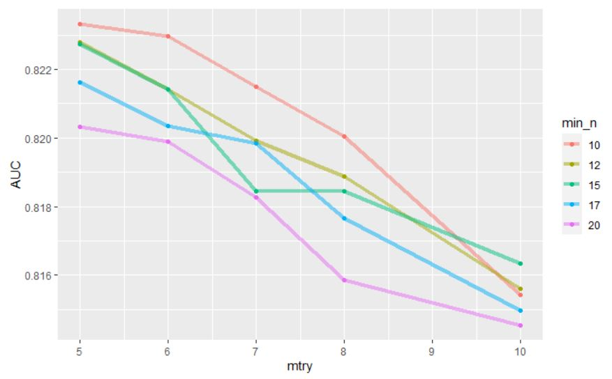
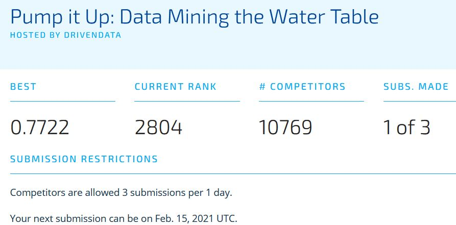

<center> <h1> Pump it or Leave it? </h1> </center>
<center> <h2>A Water Resource Evaluation of the Tanzanian Ministry of Water</h2> </center> 

### **Introduction:** 
#### Our project has a goal of predicting the functionality of water pumps in Sub Saharan Africa  and discovering which pumps need repairs, which pumps don't work at all, and which pumps are functional. We aim to create a tool for development agencies and governments to use to gain a better understanding of the infrastructure and integrity of these vital water resources for these underdeveloped and quickly growing regions of the world. Functionality rate of hand pumps in selected Sub-Saharan countries was 36% in 2009, and is respectively 15% and 25% one year and two years after construction in 2016^[Banks, Brian Furey, Sean. (2016). What’s Working, Where, and for How Long: A 2016 Water Point Update. 10.13140/RG.2.2.31354.49601]. By identifying the water pumps that need repair or are deemed to be not functional, we can bring awareness and the support needed to provide the resources to these areas that so desperately need access to clean water. 

### **Data Processing:** 
#### *How did you split the data, how did you choose features to include, how did you clean/impute/engineer the data? What kind of preliminary statistical analysis did you run?*
#### The data provided to us included 41 variables as integer, number or characters, with 59,400 observations. We identified that there were no blank observations, however we did find that there were 4,609 blank cells in the data set, we replaced those blank cells with NA’s. This brought the total amount of NA’s in this dataset to 46,094, which is approximately 1.89% of the total number of cells. Around 47.42% of the NA’s in our datasat were from the scheme_name feature, which is described to be “Who operates the waterpoint”. We then performed a screening process and concluded to remove 15 of the 41 variables in our dataset and only use 25 of the available features. We removed the 15 features due to irrelevance, redundancy and them not being used for the analysis. In working with the 25 features, it became apparent that excessively long training times was causing us problems. So we further left out the date, coordinate, and subvillage features for a total of 20 features. These five features were very granular and took up a lot of computation time.  We also changed the data type to specific predictors. We changed the status_group, basin, and public_meeting to factors. To train and test our algorithms, we initially assigned 25% of the data to our testing set, and the other 75% was assigned to our training set.

### **Data Analysis:** 
#### *What kind of machine learning algorithm did you use? How did you tune it? How did you evaluate it? How did it perform on your training data?*
#### In looking over the data types we had for this project, we determined a tree based algorithm would provide the flexibilty needed for the many catagorical features in the dataset.  The selection of randomForest allowed us  to leverage the combine the output of multiple (randomly created) decision trees in generating final output inherant in its design. The trade-off for this flexibilty was longer training times. The model was tuned on the paramters mtry, and min_n, using V-fold cross-validation. We used 5 folds and created a grid of 10 values which was poltted as an AUC point plot. We then took our best guess at a minumum range for mtry and min_n and trained a grid_regular() model with this data and 5 levels. We then took the select_best() from this analysis for our final model parameters. Our training data had an accuracy of ~77.4 % and and roc_auc of ~ 83.4 %.
```{r, out.width="600px", echo=FALSE, message=FALSE}



```

### **Results:** 
#### *How did your model perform on the test data? What does that mean for predicting water pump functioning in the real world? What did your model do well? What could your model do better? How could future researchers build on or learn from your model?*
#### We submitted our results to DRIVENDATA and received a score of  ~77.2 %, which was nearly identical to our accuracy score on the training data. Our rank was 2804 out of 10770 so we performed better than 7,966 other submissions or in the ~ top quarter of submissions. Although not bad for a completion, it would be just borderline for use in practice, as the most difficult factor to model is functional needs repair. To be able to accurately predict this factor, changes in features over time may be required. Researchers could look at additional features that may be more relevant to  pump performance like time between last maintenance, or failures related to age.   

```{r, out.width="600px", echo=FALSE, message=FALSE}

```

